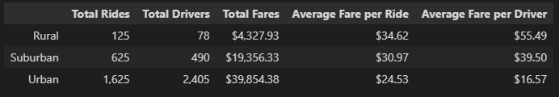
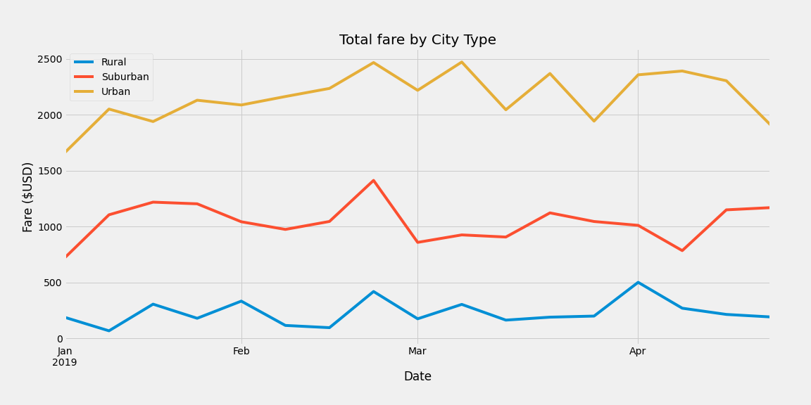

# pyber-analysis
Data Analysis Bootcamp - Week 5

## Overview
The purpose of this project was to analyze data from a rideshare company, PyBer, and create displays for a presentation comparing the company's position in urban, suburban, and rural locations. A summary of the requested deliverables is included below. The last two bullet poitns will be the focus of this report.

> Deliverables:
> - Create a bubble chart that showcases the average fare versus the total number of rides with bubble size based on the total number of drivers for each city type, including urban, suburban, and rural.
> - Determine the mean, median, and mode for the following:
>     - The total number of rides for each city type.
>     - The average fares for each city type.
>     - The total number of drivers for each city type.
> - Create box-and-whisker plots that visualize each of the following to determine if there are any outliers:
>     - The number of rides for each city type.
>     - The fares for each city type.
>     - The number of drivers for each city type.
> - Create a pie chart that visualizes each of the following data for each city type:
>     - The percent of total fares.
>     - The percent of total rides.
>     - The percent of total drivers.
> - A ride-sharing summary DataFrame by city type.
> - A multiple-line chart of total fares for each city type.

## Resources 
- Data Sources: [city_data.csv](resources/city_data.csv), [ride_data.csv](resources/ride_data.csv)
- Software: Python 3.7.13, Jupyter Notebook 6.4.8

## Analysis

This analysis was worked in a Jupyter Notebook, written with Python, and largely relied upon the Pandas and Matplotlib libraries. We were given two csvs, one containing ride data and one containing data about the cities the company operates in. We were able to merge the ride and city data csvs into one working data frame by using the "city" column. From this combined dataframe we had all the information we needed to calculate the requested statistics and displays. The results below will focus on the summary data frame and multiple-line chart of total fares by city type deliverables created for the challenge.

## Results
### Describe some differences in ride-sharing data among the different city types. 

There's a steady increase in rides, drivers, and total fares moving from Rural to Urban type locations. Conversely, the average fare per rider and average fare per driver goes down when looking from Rural to Urban locations. This could most likely be explained by urban trips being typically shorter, maybe moving from one neighborhood to another, versus in a rural location where rides are taken less often but, since the area is so spread out, they have to move a longer distance to get somewhere else. Below is the summary dataframe showing the information:

Even though the average fare per ride and driver are lower in urban areas, the sheer number of rides taken there more than makes up for it and it is clearly the most lucrative location both for the drivers and the company itself. The graph below shows the weekly total fares by city type for the first third of 2019:

## Summary
### Summarize three business recommendations to the CEO for addressing any disparities among the city types.

1. One thing the company can do is make itself aware of fairs, block parties, or any other type of events happening in suburban and rural areas near their urban cities. On these days the company could offer a bonus for drivers to leave the city and work in those areas, which could have the effect of getting more satisfied customers in those less-served areas and more money for the drivers.
2. The company could subsidize rural rides using profits from urban rides for a short time to find out if a lower cost gets more people riding in those areas, or if, culturally, rideshare services have a ceiling in locations with such large distances between points of interest.
3. The company could run advertisements in suburban areas to try and hire drivers who only want to stay in those areas. A lot of rides may be taken from suburban areas into urban cores, leaving the suburbs without drivers later in the night. If there were a way to recruit people and only send them rides that are staying out in the suburbs that may lead to more people in those areas taking rideshares out to dinner or drinks if they know a car will be available when they're done.
